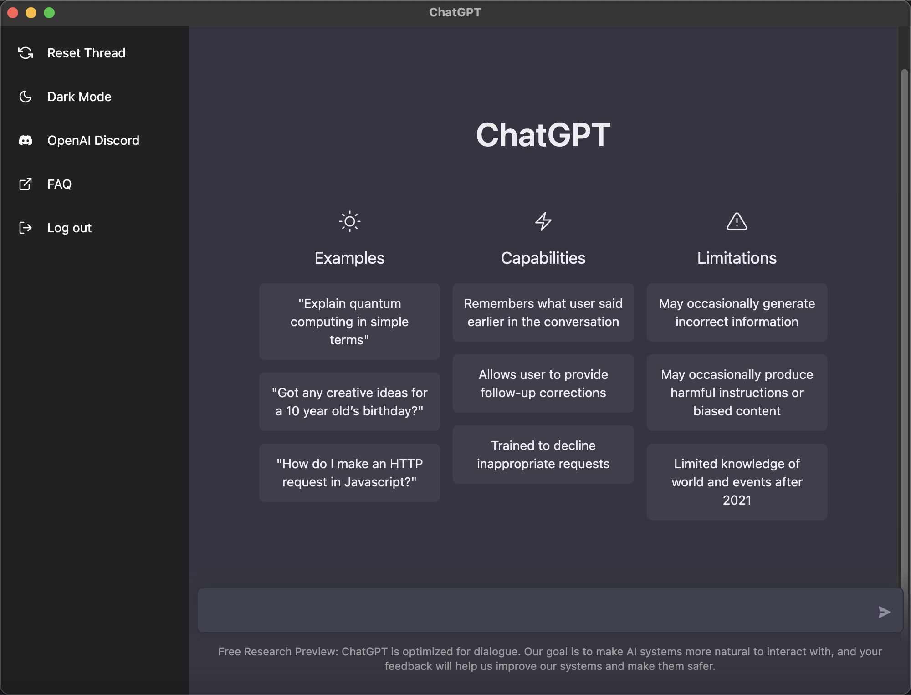
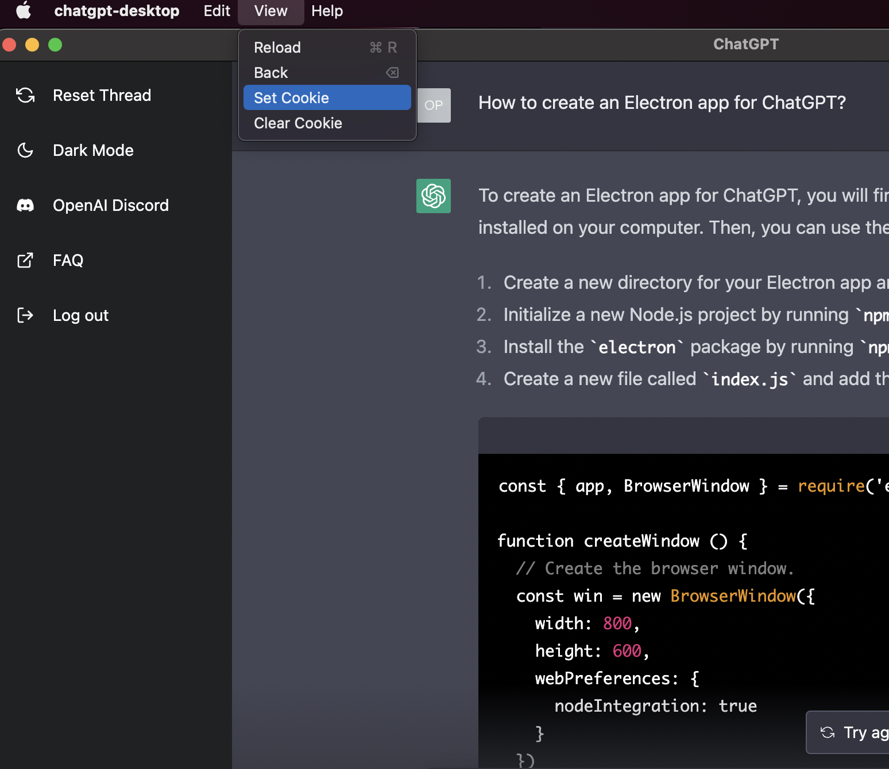

# OpenAI ChatGPT Desktop built with Electron



## Install

Download the dmg file from the [latest release](https://github.com/zhuzilin/chatgpt-desktop/releases/latest).

## Manually load cookie



If you are not able to normally login, you could use \[Tool\] -> [Set Cookie] to load session token into cookie from a certain file.

To get the sesson token, check the instruction in [chatgpt-api](https://github.com/transitive-bullshit/chatgpt-api#session-tokens). 

## Run from source

Clone the code from github and download the dependencies:

```bash
git clone git@github.com:zhuzilin/chatgpt-desktop.git
cd chatgpt-desktop/
npm install
```

Run with npm:

```bash
npm start
```

Build the installer:

```bash
npm run build
```

## Help needed!

It would be great if someone could help me with the windows and linux build :)
